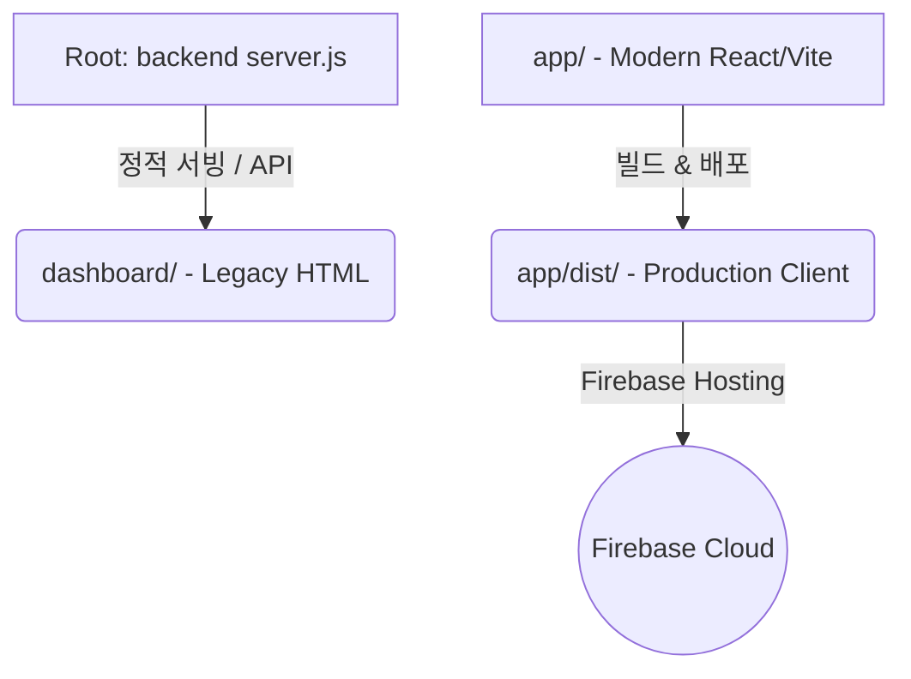

# YSACC Trade Management System (무역 관리 프로그램)

이 프로젝트는 (주)와이에스에이씨씨(YSACC)의 무역 및 견적(Proforma Invoice), 상품(Product Master) 관리를 위한 하이브리드 포탈 시스템입니다.

---

## 📂 프로젝트 구조 및 아키텍처 (Architecture)

프로젝트는 미래의 개발자 및 AI 모델이 혼동 없이 유지보수할 수 있도록 다음과 같이 명확히 이원화 및 정규화되어 있습니다.



### 1. 🚀 Modern Frontend (`/app`) - **현재 메인 운영 버전**
* **기술 스택:** React 18, Vite, TypeScript, HSL 현대적 CSS 디자인 시스템.
* **배포처:** Firebase Hosting (`app/dist` 경로가 빌드 산출물로 빌드되어 배포됨).
* **핵심 컴포넌트:**
  * `PIFormModal.tsx`: 견적서(PI) 신규 작성 및 실시간 Revision(개정) 이력 관리.
    * *핵심 로직:* 패킹 방식 변경 및 PLT 수량 입력 시 수량 자동계산 기능 탑재.
  * `ProductModal.tsx`: 상품 마스터 추가/수정 모달.
    * *핵심 로직:* 파렛트별 적재 및 규격(Pallet Spec)이 반응형 2단 그리드로 배치되어 순중량/총중량의 시각적 컷오프(Clipped) 방지. 실시간 입력 시 지워지지 않던 `0` 입력을 원천 방지(임시 원시 문자열 저장 후 저장 시 파싱).
* **빌드 방법:** 
  ```bash
  cd app
  npm run build
  ```

### 2. 🔌 Backend API Server (`/server.js`)
* **기술 스택:** Node.js, Express, PostgreSQL (`pg` pool 연동).
* **역할:** 로컬 및 특정 서버 환경을 위한 REST API 제공 및 백엔드 로직 처리.
* **실행 방법:**
  ```bash
  npm run dev
  ```

### 3. 💾 Database (`/db`, `/db_scripts`)
* **데이터베이스:** PostgreSQL.
* **역할:** 회사(companies), 고객사(customers), 상품(products), 견적서(proforma_invoices) 등의 실시간 정규화 데이터 저장소.

### 4. 🪵 Legacy Frontend (`/dashboard`)
* **기술 스택:** 정적 HTML/CSS/Vanilla JS.
* **역할:** 초기 개발된 정적 HTML 대시보드 화면들. 현재는 하위 호환성 및 개발 백업용으로 유지되고 있으며, 로컬 Express 서버(`server.js`) 실행 시 `http://localhost:3000`에서 서빙됩니다.

---

## 🛠️ 개발 및 배포 가이드 (Deployment)

### 1. 클라이언트 빌드 및 Firebase 배포 (추천)
로컬에서 React 클라이언트를 빌드하여 Firebase Hosting에 반영하는 표준 프로덕션 배포 파이프라인입니다.
```bash
# 1. React 앱 빌드
cd app
npm run build

# 2. Firebase 호스팅 배포
cd ..
npx firebase-tools deploy
```

### 2. 로컬 백엔드 서버 구동
PostgreSQL 데이터베이스 연동 테스트 및 API 서버 작동을 위해 사용됩니다.
```bash
# 루트 디렉토리에서 실행
npm install
npm run dev
```

---

## 💡 AI 모델 및 개발자 주의사항 (Important Guidelines)

1. **상태 관리와 형변환**
   * 사용자 타이핑 중 소수점(`.`) 입력과 완전히 지우기(Backspace) 편의성을 제공하기 위해, React Form 입력 단에서는 실시간 문자열 상태를 허용하고 **최종 저장 함수(`handleSave...`) 호출 시점에만 일괄적으로 `parseFloat` / `parseInt` 형변환**을 거칩니다.
2. **레이아웃 깨짐 주의**
   * 파렛트 사양 입력과 같이 다양한 컬럼을 품고 있는 입력 폼은 한 줄에 지나치게 좁은 간격으로 배치하면 우측 필드가 잘릴 위험이 있으므로, 가급적 **3열 반응형 그리드(`repeat(3, 1fr)`)** 배치를 권장합니다.
3. **소스 파일 독립성**
   * 변경 사항은 반드시 메인 React 프론트엔드인 `app/src/` 아래의 컴포넌트에 우선 반영하고, 레거시 정적 페이지(`dashboard/`)에도 필요한 경우 동기화하여 혼란을 최소화해야 합니다.
